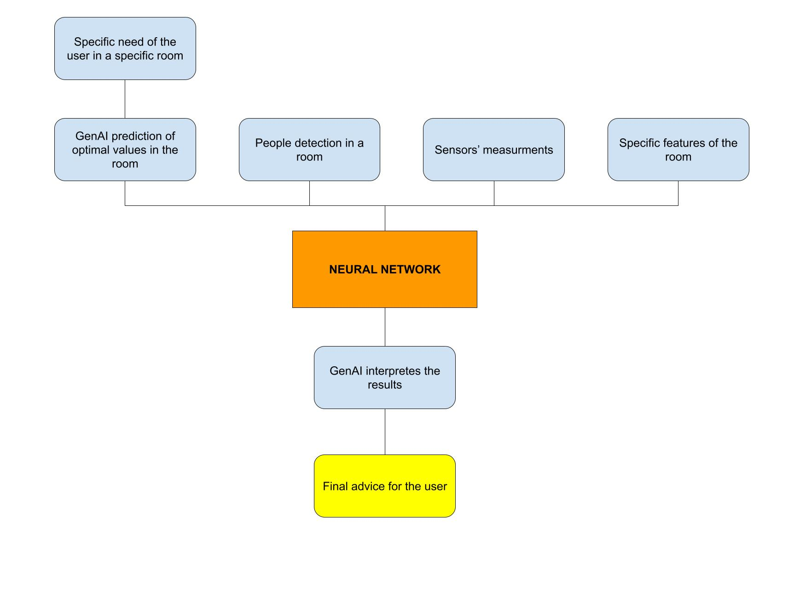
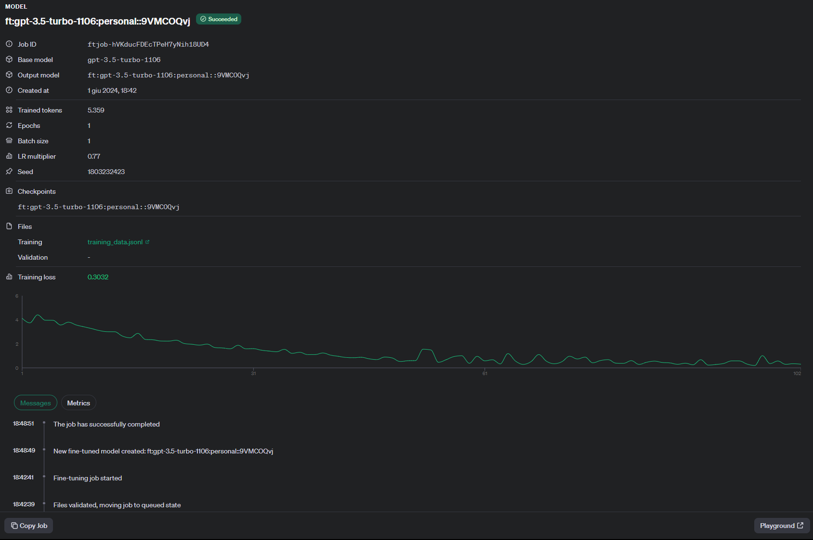
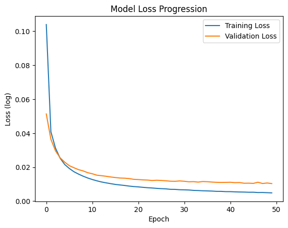

# FINAL ROUND SARAJEVO 2024: TIE TEAM
## CHALLENGE THEME: Smart Home & GenAI

### DESCRIPTION OF OUR IDEA

We first started gathering ideas in order to understand how generative AI could be useful to make a home smart.  
Considering that we could have access to some measurments regarding levels of CO2, temperature and pressure in all the rooms of a house, 
we focused on the following theme: "**create an AI assistant which, according to our needs and request at every time of the day, can suggest how to manage the windows and the shutters of a room in order to create the healthiest and most suitable environment**". 
Therefore, our idea is based on the following features: 
1. **FULL KNOWLEDGE OF THE HOUSE**: we developed an application where you can set up some important information about your house, like:
- number of rooms
- squared metres of every room
- number of windows of every room
- dimension of each window
  
2. **SMART SENSORS**: data about the house are collected by smart sensor which provide data to the genAI assistant. In particular, the sensors collect data about:
- temperature in a room in celsius
- levels of CO2 in a room in ppm
- level of humidity in a room 
- level of brightining in a room
- level of pressure in a room in atm
- sensor that detects if a window is opened or closed
- sensor that detects how much a shutter is down: it gives a percentage according to the dimensions of the window
- microphone in every room of the house in order to let people communicate with the assistant
- camera in every room of the house that takes a picture of the room
  
3. **FULL CUSTOMIZATION**: people can talk directly voice to voice with the AI assistant. You can tell him to give advice in order to optimize the air quality and brightness in a specfic room according to your needs. For example: "Hi, in ten minutes I will go to my bedroom because I have to study math and I need a place to stay focused and learn in peace.", "Hi, this evening I will have 3 guests for dinner. One of them is a guy suffering from asthma. What should I do to make the dining room comfortable?"
   
5. **SMART AND SPECFIC ADVICE**: once listening to your request, the AI assistant will calculate and predict the optimal values of CO2 concentration, brightness, temperature, pressure and humidity to have in the room you need to go or do your activity. Then, according to the actual measurments, the assistant will automatically understand how to optimize windows and shutters: it will give you advice of which windows open, which windows close and it will communicate to the shutters'sensors so that they will go up and down automatically and reach the optimal height. In this way, it is also possibile to have better **energy saving** in your house: for example, our AI assistant will tell you if you really need to turn on artificial lights or if the brightness coming from windows is sufficient.
   
7. **EASY TO USE**: our system is really easy to use because you can interact with the assistant voice to voice. Moreover, through our application you will see in real time all the significant data about the house and visualize the advices of the assistant.

### TECHINICAL SPECIFICATIONS
In order to develop the whole idea, we create a complex AI-integrated model, which is structred as follows: 

- STEP 1: **GENERATION OF SYNTHETIC DATASETS:** We used gpt-4o to create syntethic data in order to train and test our model. We created the syntethic dataset keeping into consideration all the correlations between variables, for example the number of people in a room is related positively to the levels of CO2 in a room.
  
- STEP 2: **FINE-TUNING OF A LLM:** We fine-tuned the model "gpt3.5-turbo-1106" in order to train it to predict the optimal values of CO2, humidity, brightning, pressure, temperature according to the needs and the request of the user. In order to fine-tune we used the Fine_Tuning Playground of OpenAI.

  
- STEP 3: **PEOPLE DETECTION:** In order to train the model to optimize windows and shutters of a room, we need to know how many people are in the room during a specific moment. To do that, we used a python library of computer vision, yolo, in order to detect, recognize and calculate the number of humans in a room.
  
- STEP 4: **TRAIN A NEURAL NETWORK:** The main part of our model consists of a neural network which has the aim to decide which windows should be closed, which should be opened and the best height of the shutters in order to create the best environment for the needs of the user. The neural network receives many input parameters, which are: the current number of people in the room, the mean of the current measurments detected by the sensors, the day of the measurments, the hour of the measurments, the current status of each window, the current status of each shutter, the external temperature. The neural network returns in output the new status of each window and of each shutter. We build and trained the neural network using the python library tensorflow

  
- STEP 5: **GIVE THE OUTPUT OF THE NEURAL NETWORK TO THE GENAI ASSISTANT:** Once we have calculated the optimal status of each window and each shutter we pass them to our generative AI so that it can interpret them and formulate meaningful sentences for the user giving advices. For the part of STT and TTS we use whisper and OpenAI tts.

### DESCRIPTION OF THE FILES IN THIS REPOSITORY
A more detailed description of the single functions and the whole structure of the code can be found inside every file. 
Here it is a general description of what every file does: 
- get_cv.py: detection of people in a room
- get_targets.py: calculate and returns the optimal values of co2, temperature, humidity, pressure and brightness in a room according to the needs of the user
- get_audio.py: text-to-speech
- main.py: communicates with all the other files and send the data to the client using sockets.
- fine_tuning.ipynb: fine tune the llm model gpt 3.5 turbo
- train_nn.ipynb: train the neural network 

### STEP BY STEP GUIDE
1. Install all the libraries from the file requirements.txt: pip install requirements.txt
2. Fine tune the llm running the file fine_tuning.ipynb
3. Train the neural network running the file train_nn.ipynb
4. One trained, the model will be loaded in my_model.h5
5. Run the file main.py

### FUTURE IMPROVEMENT
Our smart home AI assistant is a robust and versatile system, but there is always room for improvement. Here are some areas where we plan to enhance the functionality and performance of our system:

1. **Integration with More Devices**: Expand compatibility with a wider range of smart home devices such as HVAC systems, smart lighting, and advanced home security systems to offer a more comprehensive smart home experience.

2. **Enhanced Personalization**: Implement advanced machine learning algorithms to allow the AI assistant to learn from user behaviors and preferences over time, providing even more personalized suggestions and adjustments.

3. **Energy Consumption Optimization**: Develop more sophisticated models to better predict and manage energy consumption, integrating renewable energy sources and real-time energy pricing data to further reduce energy costs.

4. **Improved User Interface**: Enhance the user interface of the application to be more intuitive and user-friendly, with features such as drag-and-drop room configuration, real-time analytics dashboards, and more detailed visualizations of the data and AI recommendations.

5. **Scalability**: Improve the scalability of the system to handle larger homes and more complex configurations. This includes optimizing the underlying architecture to efficiently manage increased sensor data and user interactions.

6. **Continuous Improvement through Feedback**: Implement a feedback mechanism where users can report issues, suggest features, and provide general feedback, allowing us to continuously improve the system based on real user experiences.

By focusing on these areas, we aim to create an even more efficient, user-friendly, and comprehensive smart home AI assistant that can significantly enhance the comfort and health of users' living environments. 
